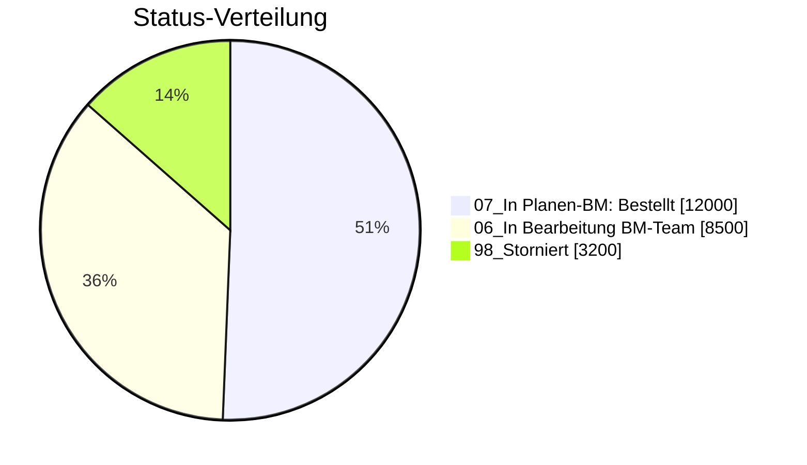

# Skill: BPLUS-NG Export

Dieser Skill beschreibt den Workflow, um Uebersichten aus **BPLUS-NG/EK** (Konzeptuebersicht / Vorgangsuebersicht / Abrufuebersicht / BM-Uebersicht / Ausgaben) als CSV- oder Excel-Datei herunterzuladen.

## Pflicht: Analyse-Script verwenden

> **WICHTIG:** Bei Analysefragen zu BPLUS-Daten (Firma/EA/Status/Summen) IMMER das Analyse-Script `analyze_bplus_api.py` ausfuehren.
> Summen, Aggregationen und Filterungen NIEMALS manuell berechnen oder aus der CSV-Datei ablesen.
> **NIEMALS eine bereits vorhandene Ergebnis-Datei (.md) wiederverwenden.** Das Script muss bei JEDER Anfrage neu ausgefuehrt werden, damit die Daten aktuell sind.
>
> **Workflow:**
> 1. CSV exportieren per `export_bplus_api.ps1` (falls noch nicht vorhanden oder älter als 1 Tag)
> 2. `python analyze_bplus_api.py <csv> --firma <name>` ausfuehren (IMMER neu, nie vorhandene .md-Datei verwenden)
> 3. Das Script gibt den **Pfad zur Ergebnis-Datei** (.md) auf stdout aus
> 4. **Optional:** Falls die Userfrage Kontext erfordert (z.B. Einordnung, Hinweise, Empfehlungen), darf die Ergebnis-Datei per `replace_string_in_file` oder `read_file` + Einfuegen **vor oder nach den Tabellen** ergaenzt werden. Zahlen und Tabellen des Scripts dabei NICHT veraendern.
> 5. **NUR folgenden Satz im Chat an den User ausgeben:**
>    `Den Ergebnisbericht habe ich erstellt und hier fuer Dich abgelegt:` gefolgt von einem **klickbaren Markdown-Link** auf die Ergebnis-Datei (workspace-relativer Pfad).
> 6. **Im Chat NICHTS weiter ausgeben** — keine Tabellen, keine Zusammenfassungen, keine Zahlen. Der User oeffnet die Datei selbst.
>
> **VERBOTEN:** Zahlen, Summen oder Tabellen des Scripts im Chat anzeigen oder in der Datei veraendern. Eigene Ergaenzungen (Kontext, Fazit, Hinweise) gehoeren VOR oder NACH die Script-Daten in die Ergebnis-Datei.
>
> **Pfad:** `<WORKSPACE>/.agents/skills/skill-bplus-export/analyze_bplus_api.py`
> **Ergebnis:** `<WORKSPACE>/userdata/tmp/<datum>_bplus_<filter>.md`

## Kontext

- Der Standard Export umfasst ausschliesslich das Team **EKEK/1**. Der Export kann auf ganz EK ausgeweitet werden.
- Ersteller im Team: **Bachmann Armin**, **Bartels Timo**, **Junge Christian**.
- **Standard-Jahr:** Wenn der User kein Jahr nennt, wird immer das **aktuelle Jahr** verwendet. 

## Darstellung von Einzelaufstellungen

Tabellen immer als pretty printed Markdown-Tabellen darstellen.
Nutze zur Visualisierung wenn möglich mermaid pie showData Charts.
Wenn einzelne Vorgaenge/Abrufe als Tabelle aufgelistet werden, muessen mindestens die folgenden Spalten enthalten sein, je nach Userfrag auch mehr:

| Spalte | Pflicht | CSV-Spalte |
|---|---|---|
| Konzept | Ja | `concept` |
| EA-Nummer | Ja | `dev_order` |
| EA-Titel | Ja | `ea` |
| BM-Titel | Ja | `title` |
| Wert | Ja | `planned_value` (Ganzzahl EUR, keine Nachkommastellen) |
| Firma | Ja | `company` |
| Status | Ja | `status` (kombinierter Klartext) |
| OE | Nur bei mehreren OEs | `org_unit` |

> **Am Ende der Tabelle immer eine Summenzeile mit dem Gesamtwert ausgeben.**
> Zusaetzlich darunter die Summenwerte pro Status.
>
> **Ersteller (`creator`) ist NICHT standardmaessig anzuzeigen**, nur auf explizite Nachfrage.

### Beispiel-Ausgabe

| Konzept | EA-Nummer | EA-Titel | BM-Titel | Wert | Firma | Status |
|---|---|---|---|---:|---|---|
| K-12345 | 0043402 | VW386/0EU_K T-ROC | Aenderung Stecker | 12000 | Mustermann GmbH | 07_In Planen-BM: Bestellt |
| K-12346 | 0043516 | VW316/6EU_B1 PA ID.4 EU | Kabelbaum Anpassung | 8500 | Beispiel AG | 06_In Bearbeitung BM-Team |
| K-12347 | 0043516 | VW316/6EU_B1 PA ID.4 EU | Clip-Aenderung | 3200 | Beispiel AG | 98_Storniert |
| | | | **Summe** | **23700** | | |



## Wann verwenden?

- Der User moechte eine BM / Budget / Abruf Uebersicht aus BPLUS-NG als CSV oder Excel exportieren
- Der User erwaehnt BPLUS, Budget, Vorgangsuebersicht, Abrufuebersicht, BM-Uebersicht oder Konzeptuebersicht
- Der User moechte Daten aus dem Beschaffungstool BPLUS herunterladen

## Methodenwahl

| Methode | Wann verwenden |
|---|---|
| **API (bevorzugt)** | Standard fuer CSV-Export. Schnell (~2-3 Sek.), robust, kein Browser noetig. |
| **Playwright (Fallback)** | Nur wenn API nicht erreichbar ist, oder der User explizit Excel-Export benoetigt. |

> **Immer zuerst die API-Methode versuchen.** Playwright nur als Fallback.

## Voraussetzungen

- Der User muss im VW-Netzwerk authentifiziert sein (SSO/Kerberos)
- Fuer API-Methode: PowerShell mit `Invoke-RestMethod` (Standard)
- Fuer Playwright-Methode: MCP Playwright muss konfiguriert und aktiv sein
- KEINE Screenshots/Bilder herunterladen oder anschauen (Performance)

## URLs und API-Endpunkte

| Ressource | URL |
|---|---|
| Konzeptuebersicht (BTL) | `https://bplus-ng-mig.r02.vwgroup.com/ek/btl` |
| API: Alle BTL-Daten | `https://bplus-ng-mig.r02.vwgroup.com/ek/api/Btl/GetAll?year={year}` |
| API: Verfuegbare Jahre | `https://bplus-ng-mig.r02.vwgroup.com/ek/api/Year` |

> Hinweis: Die URL kann sich aendern (z.B. Wechsel von `-mig` zu Produktion). Falls die API nicht antwortet, den User nach der aktuellen URL fragen.

---

## Methode 1: API-Export (bevorzugt)

### Ueberblick

Die BPLUS-NG REST-API liefert alle BTL-Daten als JSON-Array. Die Filterung (OE, Status) erfolgt client-seitig. Die Authentifizierung laeuft ueber Windows-SSO (`-UseDefaultCredentials`).

### API-Details

- **Endpunkt:** `GET /ek/api/Btl/GetAll?year={year}`
- **Authentifizierung:** Windows-SSO (Kerberos/NTLM)
- **Antwort:** JSON-Array mit allen Konzepten des Jahres (alle OEs)
- **Keine Server-seitige Filterung** — Query-Parameter ausser `year` werden ignoriert

### Wichtige JSON-Felder (API) und CSV-Spalten

Das Export-Script transformiert die API-Daten in ein LLM-optimiertes CSV-Format.

| API-Feld (JSON) | CSV-Spalte | Beschreibung | Transformation |
|---|---|---|---|
| `concept` | `concept` | Konzept-Nummer | — |
| `eaTitel` | `ea` | EA-Titel | Getrimmt |
| `title` | `title` | Titel des Vorgangs | Getrimmt |
| `workFlowStatus` + `status` | `status` | Kombinierter Klartext-Status | z.B. `07_In Planen-BM: Bestellt` |
| `plannedValue` | `planned_value` | Wert in EUR | Ganzzahl, Punkt-Dezimal |
| `orgUnitName` | `org_unit` | Organisationseinheit | — |
| `company` | `company` | Firmenname | Getrimmt |
| `creatorName` | `creator` | Ersteller | Getrimmt |
| `bmNumber` | `bm_number` | BM-Nummer | — |
| `azNumber` | `az_number` | Rahmen-Aktenzeichen | — |
| `projektfamilie` | `projektfamilie` | Projektfamilie | `KEINE` → leer |
| `devOrder` | `dev_order` | EA-Nummer | — |
| `pbmText` | `bm_text` | Beschreibungstext | Newlines → ` \| ` |
| `lastUpdated` | `last_updated` | Letzte Aenderung | Nur Datum (YYYY-MM-DD) |
| `targetDate` | `target_date` | Zieldatum | Nur Datum (YYYY-MM-DD) |

### CSV-Format

- **Delimiter:** Komma (`,`)
- **Encoding:** UTF-8 ohne BOM
- **Dezimalzeichen:** Punkt (`.`)
- **Werte:** Ganzzahl (keine Nachkommastellen)
- **Strings:** Alle getrimmt (kein trailing whitespace)
- **Spaltennamen:** snake_case

### Status-Mapping (API → Anzeige)

| API `workFlowStatus` | Anzeige-Status | Im Standard-Filter enthalten |
|---|---|---|
| `WF_Created` | 01_In Erstellung | Ja |
| `WF_In_process_BM_Team` | 06_In Bearbeitung BM-Team | Ja |
| `WF_In_Planen_BM` | 07_In Planen-BM: {status} | Ja |
| `WF_Rejected` | 97_Abgelehnt | Ja |
| `WF_Canceled` | 98_Storniert | Ja |
| `WF_Archived` | 99_Archiviert | **Nein** (Standard: ausgeschlossen) |

### Workflow: API-Export per Script

Im Skill-Verzeichnis liegt das Script `export_bplus_api.ps1`.

**Pfad:** `<WORKSPACE>/.agents/skills/skill-bplus-export/export_bplus_api.ps1`

#### Standard-Export (EKEK/1, aktuelles Jahr, ohne Archivierte)

```powershell
powershell -ExecutionPolicy Bypass -File "<WORKSPACE>\.agents\skills\skill-bplus-export\export_bplus_api.ps1"
```

#### Mit Parametern

```powershell
# Anderes Jahr:
powershell -ExecutionPolicy Bypass -File "<WORKSPACE>\.agents\skills\skill-bplus-export\export_bplus_api.ps1" -Year 2025

# Andere OE:
powershell -ExecutionPolicy Bypass -File "<WORKSPACE>\.agents\skills\skill-bplus-export\export_bplus_api.ps1" -OrgUnit "EKEK/2"

# Inkl. Archivierte:
powershell -ExecutionPolicy Bypass -File "<WORKSPACE>\.agents\skills\skill-bplus-export\export_bplus_api.ps1" -ExcludeArchived $false

# Eigener Ausgabepfad:
powershell -ExecutionPolicy Bypass -File "<WORKSPACE>\.agents\skills\skill-bplus-export\export_bplus_api.ps1" -OutputPath "C:\tmp\export.csv"
```

> **Parameter `-Delimiter` wurde entfernt.** Das CSV nutzt jetzt immer Komma als Delimiter (LLM-optimiert).

#### Manueller Inline-Export (ohne Script)

> **Hinweis:** Der Inline-Export erzeugt ein Roh-CSV ohne LLM-Optimierungen. Fuer den optimierten Export das Script verwenden.

```powershell
$response = Invoke-RestMethod -Uri "https://bplus-ng-mig.r02.vwgroup.com/ek/api/Btl/GetAll?year=2026" -UseDefaultCredentials
$filtered = $response | Where-Object { $_.orgUnitName -eq 'EKEK/1' -and $_.workFlowStatus -ne 'WF_Archived' }
$filtered | Export-Csv -Path "<WORKSPACE>\userdata\bplus\$(Get-Date -Format 'yyyyMMdd')_BPlus_Export_EKEK1.csv" -NoTypeInformation -Delimiter "," -Encoding UTF8
```

### API: Haeufige Probleme

| Problem | Loesung |
|---|---|
| `Invoke-RestMethod` schlaegt fehl | Pruefen ob VW-Netzwerk/VPN aktiv; ggf. Fallback auf Playwright |
| Leere Antwort | Jahr pruefen (`/ek/api/Year` liefert gueltige Jahre) |
| Weniger Daten als erwartet | OrgUnit-Filter pruefen (exakte Schreibweise, z.B. `EKEK/1`) |
| URL nicht erreichbar | URL kann sich aendern (z.B. `-mig` entfaellt); User fragen |

---

## Methode 2: Playwright-Export (Fallback)

> **Hinweis:** Diese Methode nur verwenden wenn die API-Methode (Methode 1) nicht funktioniert oder der User explizit Excel-Format benoetigt.

## Seitenstruktur (Accessibility-Tree)

Die geladene Seite hat folgende relevante Elemente:

### Header
- Sprache umschalten: Buttons **DE** / **EN**
- User-Icon oben rechts

### Filter-Bereich (chip area / listbox)
- **Jahr-Dropdown** (`combobox "Jahr"`): Standardmaessig aktuelles Jahr
- **Filter-Chips** in einer `listbox "chip area"`:
  - `option "EKEK/1-Export"` — OE-Vorfilter (Organisationseinheit)
  - `option "Status"` — Status-Filter (z.B. nur bestimmte Status anzeigen)
  - `option "OE"` — OE-Filter
  - Jeder Chip hat ein **Icon-Element** (letztes Kind-Element des Chips) zum **Entfernen** des Filters

### Aktions-Buttons
- `button "Meine Filter"` — Gespeicherte Filtersets
- `button "+ Konzept"` — Neues Konzept anlegen
- `button "31 Ausgeblendet"` — Spalten ein-/ausblenden
- `button "Export"` — **Export-Dropdown** oeffnen

### Export-Dropdown
Nach Klick auf den **Export**-Button erscheint eine `list` mit:
- `listitem` → `"Export als Excel"` (HTML-ID: `#btnExportExcel`)
- `listitem` → `"Export als CSV"`

### Datentabelle (grid)
- Spalten: ACTION, OP, Titel, Konzept, Status, Wert, OE, Firma, Ersteller, BM-Nr., Rahmen-AZ, Proj. Fam., EA-Nr., EA, BM-Text
- Summenzeile am Ende (z.B. `∑ 4.508.527,66`)

## Workflow: Export mit optionaler Filter-Aenderung

### Schritt 1: Seite laden

```
browser_navigate → https://bplus-ng-mig.r02.vwgroup.com/ek/btl
browser_wait_for → time: 4 (Sekunden warten bis Seite vollstaendig geladen)
```

### Schritt 2: Snapshot pruefen

```
browser_snapshot
```

Pruefen ob:
- Die Tabelle mit Daten geladen ist (Zeilen in `rowgroup` sichtbar)
- Die Filter-Chips sichtbar sind

### Schritt 3: Filter anpassen (optional)

Falls der User bestimmte Filter entfernen moechte (z.B. Status-Filter):

1. Den gewuenschten Filter-Chip in der `listbox "chip area"` finden (z.B. `option "Status"`)
2. Das **Icon-Element** (letztes Kind-Element innerhalb des Chips) anklicken — das ist der Entfernen-Button
3. Warten bis die Tabelle neu geladen hat (1-2 Sekunden)
4. Snapshot pruefen ob Filter entfernt wurde (Chip sollte verschwunden sein)

**Wichtig:** Den Chip selbst anklicken oeffnet/aktiviert ihn nur. Das **Icon-Element** (generic mit leerem Text oder cancel-Symbol) innerhalb des Chips **entfernt** den Filter.

Beispiel-Sequenz zum Entfernen des Status-Filters:
```
# Chip finden: option "Status" mit ref=eXXX
# Icon (letztes Kind) finden: generic ref=eYYY
browser_click → ref=eYYY (das Icon, NICHT den Chip selbst)
```

### Schritt 4: Export ausloesen

Standard ist **CSV**. Falls der User explizit Excel verlangt, stattdessen "Export als Excel" waehlen.

```
browser_click → Export-Button (button "Export")
# Warten bis Dropdown erscheint
browser_click → "Export als CSV" (listitem mit Text "Export als CSV")
# Alternativ fuer Excel:
# browser_click → "Export als Excel" (listitem mit Text "Export als Excel")
```

### Schritt 5: Download pruefen und nach userdata\bplus verschieben

```
# 3-4 Sekunden warten
browser_wait_for → time: 4

# Neueste CSV-Datei im Downloads-Ordner finden (bei Excel: *.xlsx):
$file = Get-ChildItem "$env:USERPROFILE\Downloads" -Filter "*.csv" | Sort-Object LastWriteTime -Descending | Select-Object -First 1
$file | Format-Table Name, LastWriteTime -AutoSize

# Nach userdata\bplus verschieben und umbenennen (YYYYMMDD_BPlus_Export_EKEK1.csv):
$dest = "<WORKSPACE>\userdata\bplus"
if (!(Test-Path $dest)) { New-Item -ItemType Directory -Path $dest -Force | Out-Null }
$newName = "$(Get-Date -Format 'yyyyMMdd')_BPlus_Export_EKEK1.csv"
Move-Item -Path $file.FullName -Destination "$dest\$newName" -Force
Write-Host "Verschoben nach: $dest\$newName"
```

> **Wichtig:** `<WORKSPACE>` durch den tatsaechlichen Workspace-Pfad ersetzen (z.B. `c:\Daten\Python\vobes_agent_vscode`).

Die Datei wird umbenannt nach dem Schema:
```
YYYYMMDD_BPlus_Export_EKEK1.csv
# Beispiel: 20260314_BPlus_Export_EKEK1.csv
```

## Haeufige Probleme und Loesungen

| Problem | Loesung |
|---|---|
| Seite laedt nicht / leerer Snapshot | Laenger warten (5-8 Sek.) oder User nach Netzwerkstatus fragen |
| Filter-Chip laesst sich nicht entfernen | Das Icon-Element innerhalb des Chips anklicken, nicht den Chip selbst |
| Export-Dropdown erscheint nicht | Export-Button erneut klicken |
| Keine neue Datei im Downloads-Ordner | Laenger warten, ggf. nochmal exportieren |
| Datei nicht in userdata\bplus | Pruefen ob Move-Item fehlerfrei lief, Pfad pruefen |
| Andere Uebersicht gewuenscht | User nach konkreter URL fragen |

## Schritt 6: CSV auswerten (optional)

Im Skill-Verzeichnis liegen zwei Analyse-Scripts:

| Script | Eingabeformat | Beschreibung |
|---|---|---|
| `analyze_bplus_api.py` | API-Export CSV (von `export_bplus_api.ps1`) | **Bevorzugt.** Nutzt API-Feldnamen (`concept`, `company`, `plannedValue`, ...) |
| `analyze_bplus.py` | Playwright-Export CSV/Excel | Nutzt Playwright-Spaltennamen (`Konzept`, `Firma`, `Wert`, ...) |

### analyze_bplus_api.py (fuer API-Export)

**Pfad:** `<WORKSPACE>/.agents/skills/skill-bplus-export/analyze_bplus_api.py`

```powershell
# Gesamtuebersicht aller Firmen:
python "<WORKSPACE>\.agents\skills\skill-bplus-export\analyze_bplus_api.py" "<WORKSPACE>\userdata\bplus\export.csv"

# Nur eine bestimmte Firma:
python "<WORKSPACE>\.agents\skills\skill-bplus-export\analyze_bplus_api.py" "<WORKSPACE>\userdata\bplus\export.csv" --firma 4soft

# Nur bestimmter Status:
python "<WORKSPACE>\.agents\skills\skill-bplus-export\analyze_bplus_api.py" "<WORKSPACE>\userdata\bplus\export.csv" --status bestellt

# Nach EA-Titel filtern:
python "<WORKSPACE>\.agents\skills\skill-bplus-export\analyze_bplus_api.py" "<WORKSPACE>\userdata\bplus\export.csv" --ea "IDS.8"

# Nach Projektfamilie filtern:
python "<WORKSPACE>\.agents\skills\skill-bplus-export\analyze_bplus_api.py" "<WORKSPACE>\userdata\bplus\export.csv" --projekt MEB

# Kombination:
python "<WORKSPACE>\.agents\skills\skill-bplus-export\analyze_bplus_api.py" "<WORKSPACE>\userdata\bplus\export.csv" --firma edag --status bestellt

# Top-N Firmen:
python "<WORKSPACE>\.agents\skills\skill-bplus-export\analyze_bplus_api.py" "<WORKSPACE>\userdata\bplus\export.csv" --top 5
```

### analyze_bplus.py (fuer Playwright-Export)

```powershell
# Gesamtuebersicht aller Firmen (sortiert nach Wert):
python "<WORKSPACE>\.agents\skills\skill-bplus-export\analyze_bplus.py" "<WORKSPACE>\userdata\bplus\ExportedData.csv"

# Nur eine bestimmte Firma (Teilstring, case-insensitive):
python "<WORKSPACE>\.agents\skills\skill-bplus-export\analyze_bplus.py" "<WORKSPACE>\userdata\bplus\ExportedData.csv" --firma 4soft

# Nur bestimmter Status:
python "<WORKSPACE>\.agents\skills\skill-bplus-export\analyze_bplus.py" "<WORKSPACE>\userdata\bplus\ExportedData.csv" --status bestellt

# Kombination Firma + Status:
python "<WORKSPACE>\.agents\skills\skill-bplus-export\analyze_bplus.py" "<WORKSPACE>\userdata\bplus\ExportedData.csv" --firma edag --status bestellt

# Top-N Firmen:
python "<WORKSPACE>\.agents\skills\skill-bplus-export\analyze_bplus.py" "<WORKSPACE>\userdata\bplus\ExportedData.csv" --top 5
```

### Ausgabe

Das Script liefert:
- **Vorgaenge** (bei Firma-Filter): Einzelauflistung mit Konzept, Status, Wert, Titel
- **Aufschluesselung nach Status**: Anzahl und Summe je Status
- **Aufschluesselung nach Firma**: Anzahl und Summe je Firma (absteigend nach Wert)

> **Wichtig:** `<WORKSPACE>` durch den tatsaechlichen Workspace-Pfad ersetzen.

## Beispiel-Interaktionen

### Beispiel 1: Standard-Export (API)

**User:** "Lade mir die Vorgangsuebersicht aus BPLUS herunter."

**Agent:**
1. API-Script ausfuehren → `export_bplus_api.ps1`
2. Ergebnis pruefen (Anzahl Datensaetze, Gesamtwert)
3. Fertig — CSV liegt in `userdata\bplus`

### Beispiel 2: Export ohne Status-Filter (API)

**User:** "Lade mir die Vorgangsuebersicht aus BPLUS ohne Status-Filter herunter."

**Agent:**
1. API-Script mit `-ExcludeArchived $false` ausfuehren
2. Ergebnis pruefen

### Beispiel 3: Excel-Export (Playwright noetig)

**User:** "Lade mir die Vorgangsuebersicht als Excel herunter."

**Agent:**
1. Hinweis: Excel-Export nur per Playwright moeglich
2. Playwright-Workflow (Methode 2) ausfuehren
3. Export als Excel waehlen

### Beispiel 4: Auswertung

**User:** "Wie viel wurde von EDAG bestellt?"

**Agent:**
1. API-Export ausfuehren (falls CSV nicht schon vorhanden)
2. Auswertung → `python analyze_bplus_api.py <csv> --firma edag --status bestellt`
